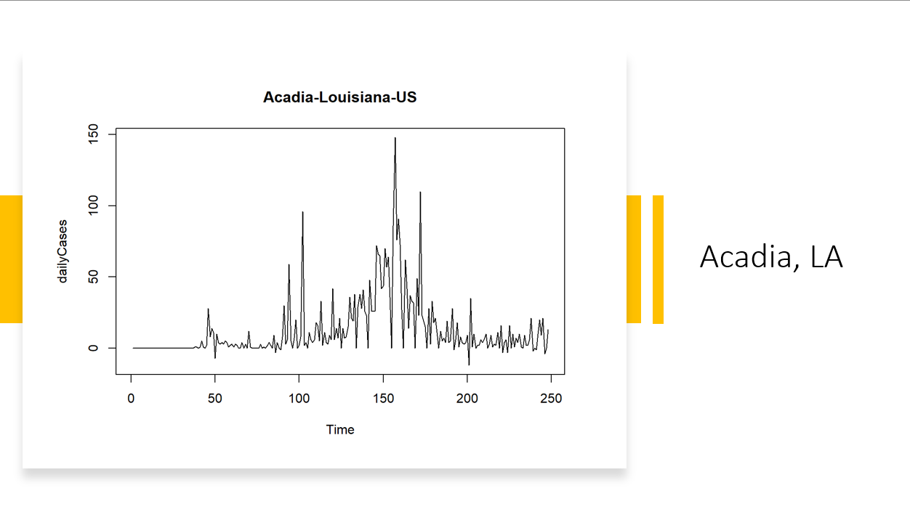

# COVID19-Cointegration
## Project Description

Co-integration analysis is a method for time series analysis that can identify associations among non-stationary variables.  Here, we applied co-integration on the COVID-19 transmission and deaths at county levels in the USA, mobility estimations, weather conditions, and social sentiments. Future work will be to identify counties with holiday peaks versus those without detectable holiday peaks and identify potential contributing factors via Twitter Sentiment Data.[^1]
[^1]: Note: This code is belongs to Qin Lab as a part of the iCompBio NSF-REU and is provided for reference only. You may not republish any of this code, make modifications to the code, etc.

## Dataset
**County3RWM** contains CSVs of all counties in the US. The data is processed and contains values related to COVID-19 spread, mobility estimates, weather conditions, and social sentiments[^2].
[^2]: The data was aggregated from Johns Hopkins University COVID Dashboard, WHO, NOAA, and the CDC.

| Source | Variables | Importance |
|---|---|---|
| National Oceanic and Atmospheric Administration (NOAA) Temperature Data | Air Temperature, Relative Humidity (RH) | It is hypothesized by many scholars that weather and temperature may have an affect on the transmission of the SARS-CoV-2 virus |
| John Hopkins COVID-19 Transmission Data | Daily Cases| Holds all the daily cases and deaths within the USA population |
| Reproduction Rates | Rt | In order to accurately analyze the factors that may contribute to the coronavirus transmission |
| Google and Apple Mobility Estimates | Apple Driving, Google Workplace, Google Residential | Helps us visualize how people in the USA are maintaining proper social distancing guidelines during lockdowns |

# Results
As shown below, there is an identifiable correlation between the transmission of COVID-19 when compared to Temperature and Humidity. My assumption is that it may be harder to control the humidity in a closed environment, resulting in more cases. This is reflected in when comparing transmission to Mobility of the US population. A valid assumption to make is that regardless of guidelines being strictly enforced when traveling to and from businesses and workplaces, people may be more likely to be 'relaxed' regarding maintaining safety when visiting friends, family, and trusted peers.

## Cointegrated Counties:
### Randolph, MO

### Acadia, LA

## Non-Cointegrated Counties
### Dickson, TN

# Acknowledgements
